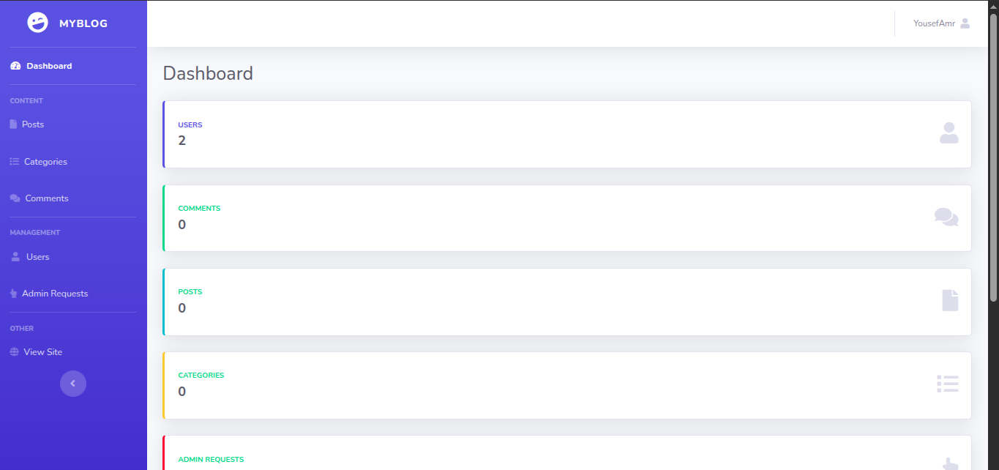

# MyBlog - PHP Blog Management System

A full-featured blog management system built with PHP, MySQL, and the SB Admin 2 theme. This application provides user authentication, post management, commenting system, and admin capabilities.

## Features

### User Features
- User registration and authentication
- View published blog posts
- Comment on posts
- Request admin privileges

### Admin Features
- Dashboard with statistics
- Post management (create, edit, publish, reject)
- Category management
- Comment moderation
- User management
- Admin request handling

## Prerequisites

- PHP 7.4 or higher
- MySQL 5.7 or higher
- Apache/Nginx web server
- PDO PHP Extension
- GD PHP Extension (for image handling)

## Installation

1. Clone the repository to your web server directory:
```bash
git clone https://github.com/iiYouseFF/MyBlog.git
cd Myblog
```

2. Create a MySQL database and import the schema:
```sql
CREATE TABLE `admin_requests` (
  `id` int NOT NULL,
  `user_id` int NOT NULL,
  `requested_at` datetime DEFAULT CURRENT_TIMESTAMP,
  `status` enum('pending','approved','rejected') DEFAULT 'pending'
) ENGINE=InnoDB DEFAULT CHARSET=utf8mb4 COLLATE=utf8mb4_0900_ai_ci;

-- --------------------------------------------------------

--
-- Table structure for table `categories`
--

CREATE TABLE `categories` (
  `id` int NOT NULL,
  `name` varchar(50) NOT NULL,
  `description` text,
  `created_at` timestamp NULL DEFAULT CURRENT_TIMESTAMP
) ENGINE=InnoDB DEFAULT CHARSET=utf8mb4 COLLATE=utf8mb4_0900_ai_ci;

-- --------------------------------------------------------

--
-- Table structure for table `comments`
--

CREATE TABLE `comments` (
  `id` int NOT NULL,
  `post_id` int NOT NULL,
  `user_id` int NOT NULL,
  `comment` text NOT NULL,
  `status` enum('pending','approved','rejected') DEFAULT 'pending',
  `created_at` timestamp NULL DEFAULT CURRENT_TIMESTAMP
) ENGINE=InnoDB DEFAULT CHARSET=utf8mb4 COLLATE=utf8mb4_0900_ai_ci;

-- --------------------------------------------------------

--
-- Table structure for table `posts`
--

CREATE TABLE `posts` (
  `id` int NOT NULL,
  `title` varchar(200) NOT NULL,
  `content` text NOT NULL,
  `image` varchar(255) DEFAULT NULL,
  `category_id` int NOT NULL,
  `views` int DEFAULT '0',
  `status` enum('draft','published') DEFAULT 'draft',
  `created_at` timestamp NULL DEFAULT CURRENT_TIMESTAMP,
  `updated_at` timestamp NULL DEFAULT CURRENT_TIMESTAMP ON UPDATE CURRENT_TIMESTAMP
) ENGINE=InnoDB DEFAULT CHARSET=utf8mb4 COLLATE=utf8mb4_0900_ai_ci;

-- --------------------------------------------------------

--
-- Table structure for table `users`
--

CREATE TABLE `users` (
  `id` int NOT NULL,
  `name` varchar(255) NOT NULL,
  `email` varchar(255) NOT NULL,
  `password` varchar(255) NOT NULL,
  `age` int DEFAULT NULL,
  `is_admin` tinyint(1) DEFAULT '0',
  `created_at` timestamp NOT NULL DEFAULT CURRENT_TIMESTAMP
) ENGINE=InnoDB DEFAULT CHARSET=utf8mb4 COLLATE=utf8mb4_0900_ai_ci;

--
-- Dumping data for table `users`
--

INSERT INTO `users` (`id`, `name`, `email`, `password`, `age`, `is_admin`, `created_at`) VALUES
(22, 'admin', 'admin@gmail.com', '$2y$12$ZAHX4gIGZXNSNt.RoYR9Nuxk59bRmXvUUWHbmf4pXD0d0DW3TbNAS', 0, 1, '2025-11-14 17:15:08');

--
-- Indexes for dumped tables
--

--
-- Indexes for table `admin_requests`
--
ALTER TABLE `admin_requests`
  ADD PRIMARY KEY (`id`);

--
-- Indexes for table `categories`
--
ALTER TABLE `categories`
  ADD PRIMARY KEY (`id`);

--
-- Indexes for table `comments`
--
ALTER TABLE `comments`
  ADD PRIMARY KEY (`id`);

--
-- Indexes for table `posts`
--
ALTER TABLE `posts`
  ADD PRIMARY KEY (`id`);

--
-- Indexes for table `users`
--
ALTER TABLE `users`
  ADD PRIMARY KEY (`id`),
  ADD UNIQUE KEY `email` (`email`);

--
-- AUTO_INCREMENT for dumped tables
--

--
-- AUTO_INCREMENT for table `admin_requests`
--
ALTER TABLE `admin_requests`
  MODIFY `id` int NOT NULL AUTO_INCREMENT;

--
-- AUTO_INCREMENT for table `categories`
--
ALTER TABLE `categories`
  MODIFY `id` int NOT NULL AUTO_INCREMENT;

--
-- AUTO_INCREMENT for table `comments`
--
ALTER TABLE `comments`
  MODIFY `id` int NOT NULL AUTO_INCREMENT;

--
-- AUTO_INCREMENT for table `posts`
--
ALTER TABLE `posts`
  MODIFY `id` int NOT NULL AUTO_INCREMENT;

--
-- AUTO_INCREMENT for table `users`
--
ALTER TABLE `users`
  MODIFY `id` int NOT NULL AUTO_INCREMENT, AUTO_INCREMENT=24;
COMMIT;

```

3. Configure the database connection in `includes/config.php`:
```php
$hostname = "localhost";
$dbname = "blog_db";
$username = "your_username";
$password = "your_password";
```

4. Set up the uploads directory:
```bash
mkdir -p uploads
chmod 755 uploads
```

6. Configure your web server to point to the project directory.

## Directory Structure

```
onsite2/
├── admin/                 # Admin panel files
│   ├── index.php         # Admin dashboard
│   ├── posts.php         # Post management
│   ├── categories.php    # Category management
│   ├── comments.php      # Comment moderation
│   ├── users.php         # User management
│   └── requests.php      # Admin request handling
├── includes/             # Shared PHP files
│   ├── config.php        # Database & auth configuration
│   ├── header.php        # Common header
│   ├── footer.php        # Common footer
│   └── sidebar.php       # Admin navigation
├── css/                  # Stylesheets
├── js/                   # JavaScript files
├── vendor/              # Third-party libraries
├── uploads/             # User uploaded files
├── index.php            # Main blog page
├── login.php            # User login
|── register.php         # User registration
├── post.php            # Single post view
├── addcomment.php      # Comment submission handler
├── addpost.php         # New post creation
└── logout.php          # User logout handler
```

## Usage

1. Access the site through your web browser
2. Register a new account
3. Log in with your credentials
4. Regular users can:
   - View posts
   - Add comments
   - Request admin privileges
5. Admins can:
   - Manage all posts
   - Moderate comments
   - Manage categories
   - Handle admin requests

## Screenshots

Below are screenshots from the application (click to view full size).

<table>
  <tr>
    <td align="center">
      
      <div>Dashboard</div>
    </td>
    <td align="center">
      
      <div>Home Page</div>
    </td>
  </tr>
  <tr>
    <td align="center">
      
      <div>Login Page</div>
    </td>
    <td align="center">
      
      <div>Registering Page</div>
    </td>
  </tr>
  <tr>
    <td align="center">
      
      <div>Posts Management</div>
    </td>
    <td align="center">
      
      <div>Add Post</div>
    </td>
  </tr>
  <tr>
    <td align="center">
      
      <div>Categories Management</div>
    </td>
    <td align="center">
      
      <div>Comments Management</div>
    </td>
  </tr>
  <tr>
    <td align="center">
      
      <div>Users Management</div>
    </td>
    <td align="center">
      
      <div>Admin Requests Management</div>
    </td>
  </tr>
</table>


## Security Features

- Password hashing
- PDO prepared statements
- Input validation
- Cookie-based authentication
- Admin privilege checks
- File upload validation

## Contributing

1. Fork the repository
2. Create your feature branch
3. Commit your changes
4. Push to the branch
5. Create a new Pull Request

## License

This project is licensed under the MIT License - see the LICENSE file for details.

## Credits

- [SB Admin 2](https://startbootstrap.com/theme/sb-admin-2) - Admin dashboard theme
- [Bootstrap](https://getbootstrap.com/) - Frontend framework
- [Font Awesome](https://fontawesome.com/) - Icons
- [jQuery](https://jquery.com/) - JavaScript library# MyBlog
